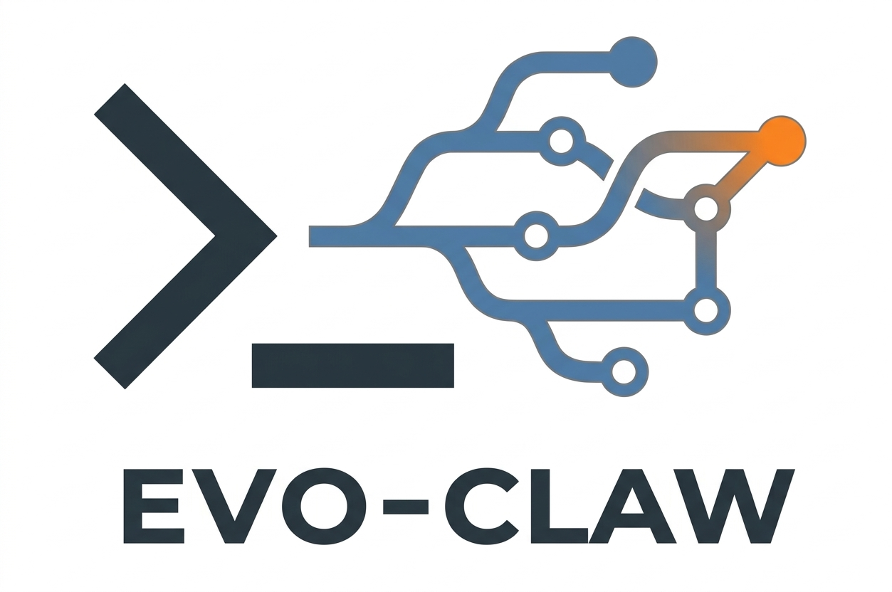
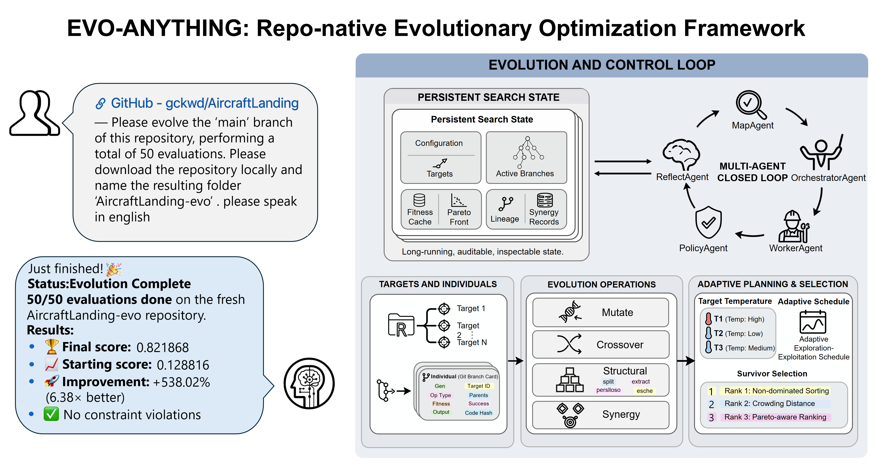

<div align="center">
  

# EvoAny Plugin — Git-Based Evolutionary Code Optimizer

[](https://github.com/DataLab-atom/EvoAny/blob/main/README_CN.md)
[](https://github.com/DataLab-atom/EvoAny/blob/main/README.md)
[](https://github.com/DataLab-atom/EvoAny/blob/main/LICENSE)
[](https://github.com/DataLab-atom/EvoAny/blob/main/package.json)
[](https://github.com/DataLab-atom/EvoAny/pulls)
[](https://github.com/DataLab-atom/EvoAny/actions/workflows/ci.yml)

[Community](#community) | [为什么用 EvoAny](#为什么用-evoany) | [安装](#安装) | [Quick Start](#quick-start) | [工作原理](#工作原理) | [Skills](#skills) | [目录结构](#目录结构) | [致谢](#致谢)
</div>



> **EvoAny 代表了一种更新的 LLM 驱动自动优化范式。** 它不再把基于大语言模型的算法/代码设计限制在特定任务模板、手工对接代码和研究型实验脚手架中，而是把整套流程推进为面向任意 git 仓库的工程化自动演化系统。沿着 LLM4AD、AlphaEvolve 等工作的方向，EvoAny 关注的不只是生成更好的候选解，更重要的是把仓库发现、环境准备、benchmark 对接、目标识别、代码生成、评测、筛选和结果追踪连接成一个真正可运行的闭环。
>
> **相比上一代常见的“先人工改造任务，再接入搜索框架”的工作方式，EvoAny 的核心优势在于更高程度的自动化和更自然的交互方式。** 用户可以直接用自然语言描述优化目标，系统再围绕 benchmark 或评测脚本自动驱动完整的演化流程，并在多轮迭代中持续筛选和保留表现更优的实现。对于算法代码、训练代码以及其他可量化评测的软件仓库，这种从半手工研究流程到全自动闭环的转变，本质上就是它最核心的价值。
>
> **作为一个集成到 OpenClaw/MCP 生态中的工程化演化引擎，** EvoAny 将 git 分支视为候选个体、将 benchmark 结果视为适应度，并结合多目标选择、策略约束和跨代记忆机制，对任意带有 benchmark 或评测脚本的代码仓库进行自动、可追踪、可持续的优化。

---

## Community

欢迎加入 EvoAny 社区交流使用经验、演化案例和后续共建计划。

<!--
<div align="center">
  
</div>
-->

---

## 为什么用 EvoAny

| 关键问题 | 传统 LLM4AD / AlphaEvolve 类流程 | EvoAny |
|---------|----------------------------------|---------|
| 任务接入 | 通常需要人工改造任务代码、补接口、接评测 | 直接面向 git 仓库，以 benchmark/eval 为入口自动对接 |
| 使用方式 | 偏研究平台或脚本编排，流程需要手动组织 | 直接自然语言交互，自动串起搜索、安装、演化和报告 |
| 自动化闭环 | 往往只覆盖搜索或局部优化环节 | 覆盖仓库发现、环境准备、目标识别、代码生成、评测、筛选、追踪 |
| 适用范围 | 更偏特定任务、预设模板或研究样例 | 面向任意可量化评测的 git 仓库 |

---

## Demo Example
<div align="center">
  
https://github.com/user-attachments/assets/ffe7deb0-ce0c-4bfb-8423-d0067c7fe356

</div>

---

## 安装

### 前置依赖

**必需：**
- Node.js >= 16
- Git
- GitHub CLI (`gh`) — 用于 `/hunt` 搜索仓库和自动开 PR

**可选（安装后会自动启用）：**
- `oracle` CLI — MapAgent 整仓库上下文分析（`npm install -g oracle`）
- `claude` CLI — WorkerAgent 复杂变体生成，用 Claude Code 代替直接 edit
- `codex` CLI — WorkerAgent 复杂变体生成的备选
- `lobster` CLI — 原子化 setup 工作流 + PR approval gate
- `tmux` — 长时间 benchmark 非阻塞后台执行
- `pyflakes` — 变体提交前 import/name 静态检查（`npm install -g pyflakes` 或 `pipx install pyflakes`）
- OpenClaw skills: `oracle`、`arxiv-watcher`、`summarize`、`session-logs`（通过 `clawhub install <slug>` 安装）

### 方式 1：npm（推荐）

```bash
npm install -g evo-anything
```

这会在 npm postinstall 阶段自动验证依赖并配置 MCP server。

安装完成后，配置你的 AI IDE：

```bash
# 一次性配置所有支持的平台（Claude Code、Cursor、Windsurf、OpenClaw）
npx evo-anything setup

# 或只配置某一个平台
npx evo-anything setup --platform claude
npx evo-anything setup --platform cursor
npx evo-anything setup --platform windsurf
npx evo-anything setup --platform openclaw
```

---

### 方式 2：从源码构建并手动接入

适用于以下情况：

- 你想本地开发或调试 EvoAny
- `npx evo-anything setup` 无法直接改写你的平台配置
- 你希望手动控制插件安装和 MCP 接入过程

整体分两步：先构建 `evo-engine`，再按你使用的平台完成接入。

#### 第 1 步：从源码构建 evo-engine（所有平台都需要）

```bash
git clone https://github.com/DataLab-atom/EvoAny.git
cd EvoAny
npm install && npm run build
```

#### 第 2 步：接入你的平台

在OpenClaw中作为插件接入，而其余平台都连接同一个 `evo-engine` MCP server，区别只在于各自的配置文件位置和 skill 接入方式。

##### OpenClaw

<details>
<summary>推荐：自动安装到 OpenClaw</summary>

```bash
npx evo-anything setup
openclaw gateway restart
```

`setup` 会把插件安装到 `~/.openclaw/extensions/evo-anything`，在 `plugins.allow` 和 `plugins.entries` 中启用插件，注册内置 skills，并把 `"evo-anything"` 写入 `tools.alsoAllow`，让 `evo_*` 工具出现在 agent 的工具表中。

</details>

<details>
<summary>开发者：重新构建后安装</summary>

```bash
npm run build
npx evo-anything setup
openclaw gateway restart
```

当你修改了 `plugin/index.ts`、`plugin/server.ts` 或其他会影响 `dist/` 的代码后，使用这个流程重新安装。

</details>

<details>
<summary>兜底：完全手动注册插件</summary>

把构建好的插件复制到 extensions 目录，并在 `~/.openclaw/openclaw.json` 中完成注册：

```bash
mkdir -p ~/.openclaw/extensions/evo-anything
cp -r dist ~/.openclaw/extensions/evo-anything/
cp -r plugin ~/.openclaw/extensions/evo-anything/
cp openclaw.plugin.json package.json ~/.openclaw/extensions/evo-anything/
```

```json
{
  "plugins": {
    "allow": ["evo-anything"],
    "entries": {
      "evo-anything": {
        "enabled": true,
        "config": {}
      }
    }
  },
  "tools": {
    "alsoAllow": ["evo-anything"]
  },
  "mcpServers": {
    "evo-engine": {
      "command": "evo-engine",
      "args": [],
      "env": {}
    }
  }
}
```

```bash
openclaw gateway restart
```

</details>

`plugins.allow` 控制 OpenClaw 是否加载这个插件；`tools.alsoAllow` 控制插件注册的原生工具是否会暴露给 coding-profile agent。

验证：

```bash
openclaw plugins info evo-anything
```

然后新开一个 agent 会话，确认 `evo_init`、`evo_get_status` 等工具已经可用。

##### Claude Code

在项目根目录或全局 `.claude/settings.json` 中添加 MCP server：

```json
{
  "mcpServers": {
    "evo-engine": {
      "command": "evo-engine",
      "type": "stdio"
    }
  }
}
```

将 skills 链接到 Claude Code：

```bash
ln -s $(pwd)/plugin/skills/* ~/.claude/skills/
```

重启 Claude Code 即可使用。

##### Cursor

在项目根目录的 `.cursor/mcp.json` 中添加：

```json
{
  "mcpServers": {
    "evo-engine": {
      "command": "evo-engine",
      "type": "stdio"
    }
  }
}
```

Cursor 会自动发现 MCP tools（`evo_init`、`evo_next_batch` 等）。Skills 需要作为 Cursor Rules 手动导入：

```bash
cp plugin/AGENTS.md .cursor/rules/evo-agents.md
```

##### Windsurf

在全局 `~/.codeium/windsurf/mcp_config.json` 中添加：

```json
{
  "mcpServers": {
    "evo-engine": {
      "command": "evo-engine",
      "type": "stdio"
    }
  }
}
```

##### 其它 MCP 兼容客户端

EvoAny 的核心是一个标准 [MCP](https://modelcontextprotocol.io) server。任何支持 MCP stdio 传输的客户端都可以接入：

```bash
# 直接启动 server（stdio 模式）
evo-engine
```

提供的 MCP tools：`evo_init`、`evo_register_targets`、`evo_report_seed`、`evo_step`、`evo_next_batch`、`evo_report_fitness`、`evo_select_survivors`、`evo_revalidate_targets`、`evo_get_status`、`evo_get_lineage`、`evo_freeze_target`、`evo_boost_target`、`evo_record_synergy`、`evo_check_cache`。

#### 可选配置

演化状态默认存储在 `~/.openclaw/u2e-state/`，可通过环境变量自定义（`U2E` 即论文名 *Understanding to Excelling* 缩写）：

```bash
export U2E_STATE_DIR=/path/to/your/state
```

或在 OpenClaw 中通过 `openclaw.json` 配置：

```json
{
  "plugins": {
    "entries": {
      "evo-anything": {
        "enabled": true,
        "config": {
          "statePath": "/path/to/your/state"
        }
      }
    }
  }
}
```

## Quick Start

```
你说：优化这个仓库 https://github.com/example/long-tail-repo
      benchmark 命令是 python benchmark.py --dataset cifar100_lt
      优化目标是 top1=max, latency=min
      预算设为 120 次评估
         ↓
  调用 /evolve，初始化 repo_path、benchmark_cmd、objectives、max_fe
         ↓
  注册优化目标 → 生成首批 mutate / crossover / structural 候选
         ↓
  Worker 并行改代码 → policy check → worktree 中跑 benchmark
         ↓
  回报 fitness → 更新局部 / 全局 Pareto front
         ↓
  进入下一代，直到 120 次评估预算用完
         ↓
  输出最优分支、Pareto 结果和完整演化报告
```

## 工作原理

EvoAny 是一个**基于 MCP server 的多 Agent 演化系统**，核心不只是“生成代码然后跑 benchmark”，而是把状态管理、目标注册、变体规划、策略审查、隔离评测、Pareto 选择、记忆写回，以及后续研究分析整合成一个闭环。

在演化层，实际流程是：

1. **初始化运行状态** — `evo_init` 记录仓库路径、benchmark 命令、目标方向、种群大小、变异率 / 结构操作率、评测预算、quick check 命令和受保护文件模式。
2. **注册优化目标** — `evo_register_targets` 记录目标文件与函数，支持派生目标；结构变更后，新目标还可以继承父目标的记忆和活跃分支。
3. **规划一代候选** — server 根据各 target 的 temperature 分配预算，并调度 `mutate`、`crossover`、`structural`，以及周期性的 `synergy` 操作。
4. **派发 Worker** — 每个 batch item 都对应一个 git 分支，如 `gen-{N}/{target}/{op}-{k}`；父分支优先从 target 的 Pareto 集、当前 best branch 或 seed baseline 中选择。
5. **生成并审查代码** — WorkerAgent 先生成变体，调用 `evo_check_cache` 检查是否已有相同代码被评测过，再把 diff 提交给显式的 policy gate 审查。
6. **隔离评测** — 通过审查的候选在独立 git worktree 中跑 benchmark，再用 `evo_report_fitness` 或 `evo_step("fitness_ready")` 回报结果。
7. **多目标选择** — EvoAny 使用 NSGA-II 风格的非支配排序和 crowding distance，筛选幸存者、更新每个 target 的局部 Pareto front，并维护全局 Pareto front。
8. **动态调整搜索压力** — target 改进时 temperature 上升，长期停滞时下降；停滞 target 的 structural op 比例会提高，也可以手动 freeze / boost。
9. **结构变更后重校验** — 如果 structural op 让旧 target 失效，`evo_revalidate_targets` 会检测出来；旧 target 可被冻结，再注册带 lineage 的替代 target。
10. **写回记忆并继续** — 每一代都会更新 `memory/`、记录失败案例与 synergy 结果、给该代最佳分支打 tag，并持续推进直到评测预算耗尽。

除了核心优化器，server 还包含三层高阶能力：

- **文献层** — `lit_ingest`、`lit_search_local`、BibTeX 工具，以及基于 branch lineage 的代码问答。
- **评测 / 可视化层** — 新 benchmark 适配、隔离 benchmark 执行、与文献 SOTA 对比校验，以及图表生成 / 高亮 / 润色。
- **研究层** — `research_*` 派生森林工具，用来追踪假设、证据、收敛点和 contribution 分级，把演化结果进一步组织成论文级研究叙事。

默认情况下，演化全局状态保存在 `~/.openclaw/u2e-state/`，而具体 run 的经验记忆写回目标仓库下的 `memory/`。状态查询会汇总 generation、预算消耗、每个 target 的 stagnation 和 temperature、局部 / 全局 Pareto front，以及相对 seed baseline 的提升情况。

具体 run 的经验记忆会以结构化方式写回目标仓库，方便后续代际直接复用已有经验，而不是重复尝试已经失败过的方向：

```text
memory/
├── global/long_term.md           # 跨目标的通用经验
├── targets/{id}/
│   ├── short_term/gen_{N}.md     # 每代反思
│   ├── long_term.md              # 该目标的累积智慧
│   └── failures.md               # 失败记录（不要再试的方向）
└── synergy/records.md            # 跨函数组合实验结果
```

演化过程中产生的候选实现会直接用普通 git 分支承载，这样整个搜索过程既可追踪也可复现。单目标分支采用 `gen-{N}/{target_id}/{op}-{V}`，跨目标组合采用 `gen-{N}/synergy/{targetA}+{targetB}-{V}`，关键检查点则通过 `seed-baseline`、`best-gen-{N}`、`best-overall` 这些 tag 标记。

## Skills

| 命令 | 说明 |
|------|------|
| `/hunt <任务描述>` | 搜索 GitHub 找到合适的仓库，自动 clone、安装、跑基线，然后启动演化 |
| `/evolve <repo> <benchmark_cmd>` | 对指定仓库启动演化优化循环 |
| `/status` | 查看当前演化进度 |
| `/report` | 生成完整的演化报告 |
| `/boost <target_id>` | 提升某个优化目标的优先级 |
| `/freeze <target_id>` | 冻结某个目标，停止对它的演化 |

## 目录结构

```
EvoAny/
├── LICENSE
├── README.md
├── README_CN.md
├── research/                  # 生态调研文档
│   ├── 01_openclaw_existing_capabilities.md
│   ├── 02_compatible_products_capabilities.md
│   ├── 03_evo_anything_analysis.md
│   └── 04_ecosystem_capability_map.md  # 生态能力全景图
└── plugin/
    ├── openclaw.plugin.json   # 插件定义
    ├── AGENTS.md              # 演化协议（核心循环）
    ├── SOUL.md                # Agent 人格设定
    ├── TOOLS.md               # 工具使用约定
    ├── agents/                # 各 Agent 行为说明
    │   ├── orchestrator.md    # OrchestratorAgent（含 canvas 可视化）
    │   ├── worker.md          # WorkerAgent（含静态检查、tmux、coding-agent）
    │   ├── policy_agent.md    # PolicyAgent
    │   ├── reflect_agent.md   # ReflectAgent（含跨-run 元学习）
    │   └── map_agent.md       # MapAgent（含 oracle 整仓库分析）
    ├── server.ts              # MCP 工具接口（演化引擎）
    ├── index.ts               # 插件入口
    ├── src/                   # 核心逻辑
    │   ├── models.ts          # 数据模型
    │   ├── selection.ts       # 选择算法
    │   └── state.ts           # 状态管理
    ├── skills/                # 用户可调用的技能
    │   ├── hunt/              # 搜索并部署代码库（含 arxiv-watcher）
    │   ├── evolve/            # 启动演化循环（含 lobster 工作流）
    │   ├── status/            # 查看进度
    │   ├── report/            # 生成报告
    │   ├── boost/             # 提升目标优先级
    │   └── freeze/            # 冻结目标
    └── workflows/             # Lobster 声明式工作流
        ├── evo-setup.lobster  # 原子化 setup（validate→baseline→tag→mkdir）
        └── evo-finish.lobster # 结束流程（tag→push→approval gate→PR）
```

---

## 致谢

我们的工作参考了以下论文/项目（仅列举部分）:

- [From Understanding to Excelling: Template-Free Algorithm Design through Structural-Functional Co-Evolution](https://arxiv.org/abs/2503.10721)
- [Evolution of Heuristics: Towards Efficient Automatic Algorithm Design using Large Language Model](https://github.com/FeiLiu36/EoH)
- [LLM4AD: Large Language Model for Algorithm Design](https://github.com/Optima-CityU/LLM4AD)
